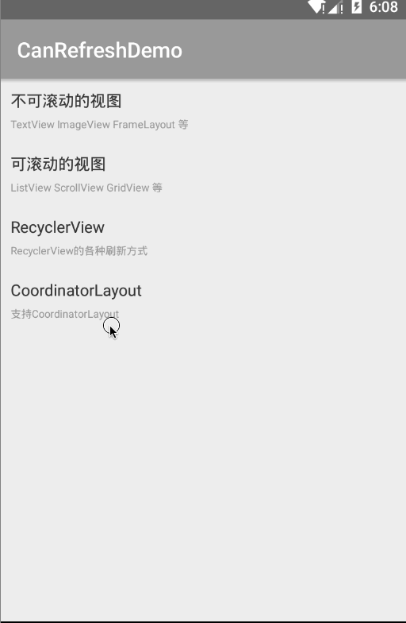

# CanRefresh

 可适配所有视图的下拉刷新上拉加载，并支持各种风格。
 
   

## 添加依赖
```
compile 'com.canyinghao:canrefresh:1.1.1'
```

## 使用方式 
**1. 使用方法**  
CanRefresh是一个刷新控件，可适配任何view，可下拉刷新上拉加载。OnRefreshListener是下拉监听，OnLoadMoreListener是上拉监听。refresh.setStyle(type, type)中第一个参数是下拉的风格，第二个参数是上拉的风格。风格有四种，经典风格、在视图前面、在视图后面、居于拉动间隔的中间。预置五种刷新效果，经典效果、旋转效果、google效果、StoreHouse效果、Yalantis效果。可自由组合。若不想要预置的效果，只需要将CanRefresh类和CanRefreshLayout类拷入自己项目中，继承CanRefresh类自己写效果即可。
```

public class RVRefreshFragment extends Fragment implements CanRefreshLayout.OnRefreshListener, CanRefreshLayout.OnLoadMoreListener {


    public final static String TYPE = "type";

    @Bind(R.id.can_content_view)
    RecyclerView recyclerView;
    @Bind(R.id.refresh)
    CanRefreshLayout refresh;
    CanRVAdapter adapter;

    int type;
    LinearLayoutManager mLayoutManager;

    public static RVRefreshFragment newInstance(int type) {
        RVRefreshFragment fragment = new RVRefreshFragment();
        Bundle bundle = new Bundle();
        bundle.putInt(TYPE, type);
        fragment.setArguments(bundle);
        return fragment;
    }

    @Override
    public void onCreate(@Nullable Bundle savedInstanceState) {
        super.onCreate(savedInstanceState);
        type = getArguments().getInt(TYPE, 0);

    }

    @Nullable
    @Override
    public View onCreateView(LayoutInflater inflater, ViewGroup container, Bundle savedInstanceState) {

        int layoutId;
        switch (type) {
            case 0:
                layoutId = R.layout.fragment_rv_classic;
                mLayoutManager = new LinearLayoutManager(getContext(), LinearLayoutManager.VERTICAL, false);
                break;

            case 1:
                layoutId = R.layout.fragment_rv_google;
                mLayoutManager = new GridLayoutManager(getContext(), 2);
                break;
            case 2:
                layoutId = R.layout.fragment_rv_yalantis;
                mLayoutManager = new LinearLayoutManager(getContext(), LinearLayoutManager.VERTICAL, false);
                break;

            case 3:
                layoutId = R.layout.fragment_rv_store;
                mLayoutManager = new GridLayoutManager(getContext(), 3);
                break;

            default:
                layoutId = R.layout.fragment_rv_classic;
                mLayoutManager = new LinearLayoutManager(getContext(), LinearLayoutManager.VERTICAL, false);
                break;
        }


        View v = inflater.inflate(layoutId, container, false);
        ButterKnife.bind(this, v);


        if (type==3){

            StoreHouseRefreshView storeHouseRefreshView = (StoreHouseRefreshView) v.findViewById(R.id.can_refresh_header);

            storeHouseRefreshView.initWithString("Hello World");
        }

        initView();
        return v;


    }


    private void initView() {

        refresh.setOnLoadMoreListener(this);
        refresh.setOnRefreshListener(this);


        refresh.setStyle(type, type);


        recyclerView.setLayoutManager(mLayoutManager);

        adapter = new CanRVAdapter<MainBean>(recyclerView, R.layout.item_main) {


            @Override
            protected void setView(CanHolderHelper helper, int position, MainBean model) {
                helper.setText(R.id.tv_title, model.title);
                helper.setText(R.id.tv_content, model.content);

            }

            @Override
            protected void setItemListener(CanHolderHelper helper) {

                helper.setItemChildClickListener(R.id.tv_title);
                helper.setItemChildClickListener(R.id.tv_content);

            }
        };

        recyclerView.setAdapter(adapter);


        adapter.setOnItemListener(new CanOnItemListener() {

            public void onItemChildClick(View view, int position) {

                MainBean bean = (MainBean) adapter.getItem(position);
                switch (view.getId()) {


                    case R.id.tv_title:

                        App.getInstance().show(bean.title);
                        break;

                    case R.id.tv_content:
                        App.getInstance().show(bean.content);
                        break;
                }


            }

        });


        adapter.setList(MainBean.getList());


    }


    @Override
    public void onDestroyView() {
        super.onDestroyView();
        ButterKnife.unbind(this);
    }

    @Override
    public void onRefresh() {

        refresh.postDelayed(new Runnable() {
            @Override
            public void run() {
                adapter.setList(MainBean.getList());
                refresh.refreshComplete();
            }
        }, 1000);

    }

    @Override
    public void onLoadMore() {

        refresh.postDelayed(new Runnable() {
            @Override
            public void run() {

                adapter.addMoreList(MainBean.getList());
                refresh.loadMoreComplete();
            }
        }, 1000);

    }
}

``` 
**2. 注意事项**  
虽说能适配任何view，但用法还是有一些规则的。不能使用RelativeLayout里面包一个RecyclerView，然后给RelativeLayout添加下拉刷新，这样的用法会出问题。  
**3. 更新日志**  
2016.7.14  
1.适配了开源项目[CanRecyclerView](https://github.com/canyinghao/CanRecyclerView)里面的CanRecyclerViewHeaderFooter，使RecyclerView支持自动加载。  


2016.6.30  
1.添加对CoordinatorLayout的支持。  
2.自定义下拉上拉的背景颜色。  


2016.4.7  
1.解决下拉刷新中依然可下拉的bug。  


### 开发者

 

canyinghao: 

<canyinghao@hotmail.com>  

[新浪微博](http://weibo.com/u/5670978460)

[google+](https://plus.google.com/u/0/109542533436298291853)


### License

    Copyright 2016 canyinghao

    Licensed under the Apache License, Version 2.0 (the "License");
    you may not use this file except in compliance with the License.
    You may obtain a copy of the License at

       http://www.apache.org/licenses/LICENSE-2.0

    Unless required by applicable law or agreed to in writing, software
    distributed under the License is distributed on an "AS IS" BASIS,
    WITHOUT WARRANTIES OR CONDITIONS OF ANY KIND, either express or implied.
    See the License for the specific language governing permissions and
    limitations under the License.

